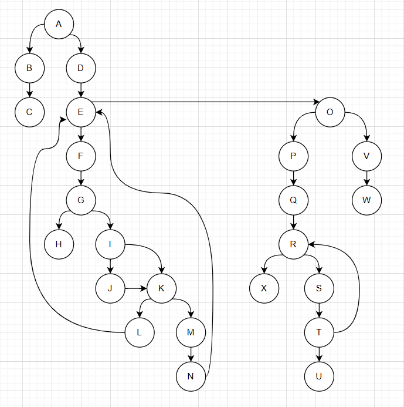

# SI_2025_lab2_193011

Марија Цековска 193011

Control Flow Graph

Почеток  //А
if (allItems == null){  //B
throw new RuntimeException("allItems list can't be null!");  //C
double sum = 0;  //D
for (int i = 0; i < allItems.size(); i++){  //E
Item item = allItems.get(i);  //F
if (item.getName() == null || item.getName().length() == 0){  //G
throw new RuntimeException("Invalid item!");  //H
if (item.getPrice() > 300 || item.getDiscount() > 0 || item.getQuantity() > 10){  //I
sum -= 30;  //J
if (item.getDiscount() > 0){  //K
sum += item.getPrice()*(1-item.getDiscount())*item.getQuantity();  //L
else {  //M
sum += item.getPrice()*item.getQuantity();  //N
if (cardNumber != null && cardNumber.length() == 16) {  //O
String allowed = "0123456789";  //P
char[] chars = cardNumber.toCharArray();  //Q
for (int j = 0; j < cardNumber.length(); j++) {  //R
char c = cardNumber.charAt(j);  //S
if (allowed.indexOf(c) == -1) {  //T
throw new RuntimeException("Invalid character in card number!");  //U
else{  //V
throw new RuntimeException("Invalid card number!");  //W
return sum;  //X
